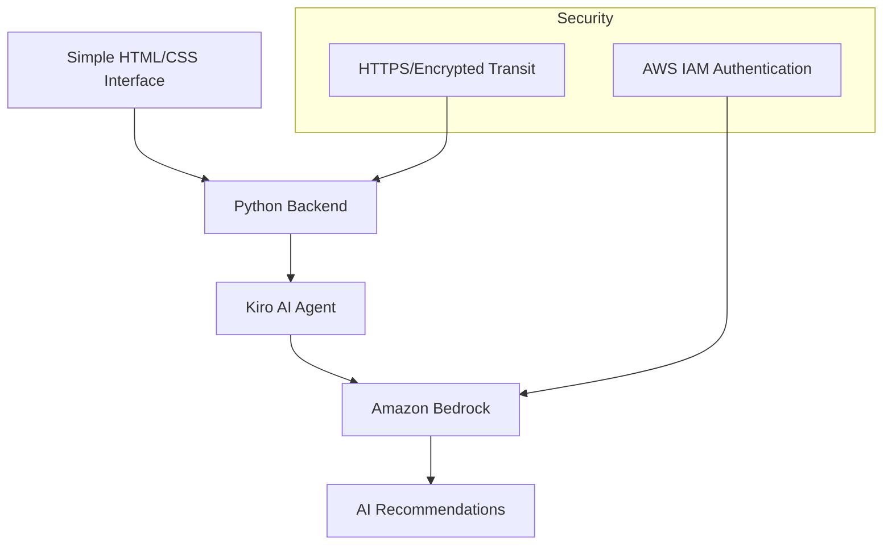

# Design Document: BharatSignal

## Overview

BharatSignal is an AI-powered decision-support system designed specifically for small general stores (kirana shops) in India. The system combines sparse sales data with local context to generate actionable business recommendations using Amazon Bedrock's foundation models.

The system prioritizes explainability and simplicity, ensuring that non-technical shop owners can understand and act on AI-generated recommendations.

## Architecture



### Key Architectural Decisions

1. **Simple Web Interface**: HTML/CSS served by Python backend, no complex frontend framework
2. **In-Memory Processing**: All data processing happens in memory for demo purposes
3. **AI-First Design**: Amazon Bedrock handles all reasoning and inference
4. **Minimal Security**: AWS IAM for Bedrock access and HTTPS for encrypted transit
5. **English-First**: Simple English output with optional Hindi support through prompt engineering

## Components and Interfaces

### Web Interface

**Simple HTML Form**
```html
<!-- Single page with all functionality -->
<form id="bharatsignal-form">
  <div class="upload-section">
    <input type="file" accept=".csv" id="csv-upload">
    <button type="button" onclick="uploadCSV()">Upload Sales Data</button>
  </div>
  
  <div class="context-section">
    <textarea placeholder="Enter local context (festivals, weather, events)"></textarea>
  </div>
  
  <div class="action-section">
    <button type="submit">Generate Recommendations</button>
  </div>
  
  <div class="results-section" id="recommendations">
    <!-- AI recommendations displayed here -->
  </div>
</form>
```

### Backend Components

**Main Application**
```python
from flask import Flask, request, render_template
import csv
import boto3
from datetime import datetime

app = Flask(__name__)

@app.route('/')
def index():
    return render_template('index.html')

@app.route('/analyze', methods=['POST'])
def analyze_data():
    csv_file = request.files['csv_data']
    context = request.form['context']
    
    # Process CSV in memory
    sales_data = parse_csv(csv_file)
    
    # Generate recommendations via Bedrock
    recommendations = get_ai_recommendations(sales_data, context)
    
    return render_template('results.html', recommendations=recommendations)
```

**CSV Processing**
```python
def parse_csv(file_content):
    """Parse CSV content into sales records"""
    records = []
    reader = csv.DictReader(file_content)
    for row in reader:
        if validate_row(row):
            records.append({
                'date': row['date'],
                'item': row['item'], 
                'quantity': int(row['quantity']),
                'price': float(row['price'])
            })
    return records

def validate_row(row):
    """Basic validation for required fields"""
    required_fields = ['date', 'item', 'quantity', 'price']
    return all(field in row and row[field] for field in required_fields)
```

**Bedrock Integration**
```python
def get_ai_recommendations(sales_data, context):
    """Get recommendations from Amazon Bedrock"""
    bedrock = boto3.client('bedrock-runtime', region_name='us-east-1')
    
    prompt = build_prompt(sales_data, context)
    
    response = bedrock.invoke_model(
        modelId='anthropic.claude-3-sonnet-20240229-v1:0',
        body=json.dumps({
            'anthropic_version': 'bedrock-2023-05-31',
            'messages': [{'role': 'user', 'content': prompt}],
            'max_tokens': 1000
        })
    )
    
    return parse_ai_response(response)
```

## Data Models

### Sales Data Schema

The system expects CSV files with the following structure:

```csv
date,item,quantity,price
2024-01-15,Rice 1kg,10,45.00
2024-01-15,Biscuits Pack,5,25.00
2024-01-16,Tea 250g,8,120.00
```

**Required Columns:**
- `date`: Transaction date (YYYY-MM-DD format)
- `item`: Product name or description
- `quantity`: Number of units sold
- `price`: Price per unit in INR

### Core Data Structures

```python
@dataclass
class SalesRecord:
    date: str
    item: str
    quantity: int
    price: float
    
    def validate(self) -> bool:
        """Basic validation for required fields"""
        return (self.quantity > 0 and 
                self.price > 0 and 
                len(self.item.strip()) > 0)

@dataclass
class LocalContext:
    text: str  # Simple text input for context
    
    def to_prompt_context(self) -> str:
        """Convert context to natural language for AI prompt"""
        return f"Local context: {self.text}"

@dataclass
class Recommendation:
    item: str
    action: str
    explanation: str
    
    def to_display_format(self) -> str:
        """Format recommendation for display"""
        return f"{self.item}: {self.action}\nWhy: {self.explanation}"
```

### AI Prompt Structure

The system uses structured prompts to ensure consistent, relevant recommendations:

```
System: You are BharatSignal, an AI assistant for Indian kirana shop owners. 
Provide practical business advice in simple language.

Context: 
- Shop sales data: {sales_summary}
- Local context: {context_description}

Task: Generate 3-5 specific recommendations for:
1. Which items to stock more/less
2. Pricing adjustments to consider

Format each recommendation with:
- Clear action to take
- Simple explanation why

Use simple English suitable for small business owners.
```

## Correctness Properties

*A property is a characteristic or behavior that should hold true across all valid executions of a system—essentially, a formal statement about what the system should do. Properties serve as the bridge between human-readable specifications and machine-verifiable correctness guarantees.*

### Property 1: CSV Processing Robustness
*For any* CSV file input, the system should either successfully parse valid sales data (with date, item, quantity, price columns) or reject invalid files with clear error messages, and handle incomplete records gracefully without system failure.
**Validates: Requirements 1.1, 1.2, 1.4, 1.5**

### Property 2: Context Data Acceptance
*For any* valid local context input (festivals, weather, local events), the system should accept, store, and make the data available for AI processing while validating date ranges and text length limits.
**Validates: Requirements 1.3, 10.1, 10.2, 10.3, 10.5**

### Property 3: AI Integration and Analysis
*For any* combination of sales data and local context, the AI agent should use Amazon Bedrock to analyze trends, combine both data sources, and generate specific business decisions rather than generic statistics.
**Validates: Requirements 2.1, 2.2, 2.3, 2.4, 2.5**

### Property 4: Recommendation Generation Completeness
*For any* processed input data, the system should generate prioritized, actionable recommendations for both stocking and pricing decisions that focus on specific items and concrete actions.
**Validates: Requirements 3.1, 3.2, 3.3, 3.4**

### Property 5: Explanation Quality and Traceability
*For any* generated recommendation, the system should provide simple language explanations that avoid technical jargon, reference specific data points from the input, and remain accessible to non-technical users.
**Validates: Requirements 4.1, 4.2, 4.3, 4.4**

### Property 6: Language and Terminology Appropriateness
*For any* system output, explanations and interface text should use clear, simple English with terminology appropriate for Indian retail context, and where Hindi support is implemented, provide equivalent quality in Hindi.
**Validates: Requirements 5.2, 5.3, 5.4**

### Property 7: Session Data Security
*For any* user session, uploaded sales data should be processed securely using encrypted transit to Amazon Bedrock with AWS IAM authentication, and completely cleared when the session ends.
**Validates: Requirements 7.1, 7.2, 7.3, 7.5**

### Property 8: System Reliability and Error Handling
*For any* system operation, the application should process requests reliably under normal conditions, provide clear error messages when external services (like Bedrock) are unavailable, and log errors without exposing user data.
**Validates: Requirements 8.1, 8.3, 8.5**

### Property 9: Performance Responsiveness
*For any* typical CSV file processing request, the system should complete analysis and return recommendations within a reasonable time suitable for interactive use.
**Validates: Requirements 3.5, 8.4**

### Property 10: Context Integration in Recommendations
*For any* recommendation generated with local context provided, the AI should appropriately weight local factors (festivals, weather, events) in its decision-making process, with recommendations reflecting contextual influences.
**Validates: Requirements 10.4**

### Property 11: Demo Mode Functionality
*For any* demo mode operation, the system should generate meaningful recommendations using sample data and clearly distinguish demo operations from real data processing.
**Validates: Requirements 9.3**

### Property 12: Interactive Clarification Support
*For any* user request for additional reasoning, the system should provide more detailed explanations that maintain the same language simplicity standards.
**Validates: Requirements 4.5**

### Property 13: Visual Feedback Consistency
*For any* file upload or processing operation, the system should provide clear visual feedback to indicate operation status and progress.
**Validates: Requirements 6.3**

## Error Handling

### Error Categories and Responses

**Data Input Errors**
- Invalid CSV format: Return specific format requirements
- Missing required columns: Identify which columns are missing
- File size exceeded: Provide clear size limits

**AI Service Errors**
- Bedrock unavailable: Graceful error message when Bedrock is unavailable

**System Errors**
- Unexpected exceptions: Generic error message

## Testing Strategy

### Basic Manual Testing

**Testing Approach**: Manual testing with sample CSV files and demo scenarios appropriate for hackathon prototype.

**Test Scenarios**:
- Upload valid CSV files with sales data
- Test with invalid/malformed CSV files
- Verify recommendations are generated and reasonable
- Test demo mode functionality
- Verify error messages display correctly

**Sample Data Testing**:
- Use representative kirana shop sales data
- Test with various local context inputs
- Demo-time observation of performance and reliability